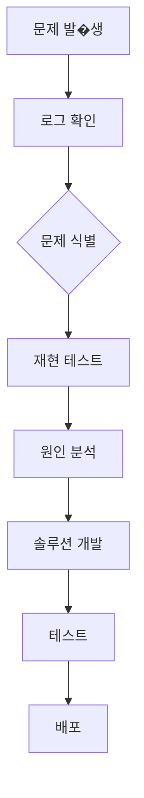

# 디버깅 가이드

이 문서는 Picko 프로젝트에서 발생하는 문제들을 해결하기 위한 디버깅 절차와 기술을 안내합니다.
> **문서 성격**: 일부 보조 스크립트(`log_analyzer.py`, `troubleshoot.py` 등)는 예시이며 현재 코드에 포함되어 있지 않습니다.

## 로그 분석 방법

### 1. 로그 파일 구조
```
logs/
└── 2026-03-04/
    ├── app.log           # 주요 애플리케이션 로그
    ├── errors.log       # 에러 로그만
    ├── debug.log        # 디버그 레벨 로그
    └── pipeline.log      # 파이프라인 실행 로그
```

### 2. 로그 레벨 및 용도
```python
from loguru import logger

# 로그 레벨 설정
logger.add("logs/{time:YYYY-MM-DD}/app.log",
          rotation="1 day",
          level="INFO")

# 사용 예시
logger.debug("디버그 정보")        # 개발 시 상세 정보
logger.info("정보 메시지")         # 정상 동작 로그
logger.warning("경고 메시지")      # 주의 필요 사항
logger.error("에러 메시지")       # 에러 발생
logger.critical("치명적 오류")     # 시스템 장애
```

### 3. 로그 분석 명령어
```bash
# 특정 날짜의 로그 확인
cat logs/2026-03-04/app.log

# 에러 로그만 확인
grep "ERROR" logs/2026-03-04/app.log

# 특정 단어 포함 로그 검색
grep "failed" logs/2026-03-04/app.log

# 실시간 로그 확인
tail -f logs/2026-03-04/app.log

# 로그 파일 크기 확인
du -sh logs/
```

### 4. 구조화된 로그 분석
```python
# 로그 파싱 도구 예시
import re
from datetime import datetime

def parse_pipeline_log(log_file):
    """파이프라인 로그 파싱"""
    pattern = r'(\d{4}-\d{2}-\d{2} \d{2}:\d{2}:\d{2}) \[(\w+)\] (.*)'

    with open(log_file, 'r') as f:
        for line in f:
            match = re.match(pattern, line)
            if match:
                timestamp, level, message = match.groups()
                yield {
                    'timestamp': timestamp,
                    'level': level,
                    'message': message
                }
```

### 5. 로그 관리 스크립트
```python
# scripts/log_analyzer.py (예시: 현재 리포지토리 미포함)
import argparse
from pathlib import Path
import json

def analyze_errors(log_dir):
    """에러 로그 분석"""
    errors = []
    log_path = Path(log_dir)

    for log_file in log_path.glob("*.log"):
        with open(log_file, 'r') as f:
            for line in f:
                if "ERROR" in line:
                    errors.append(line.strip())

    # 에러 발생 빈도 분석
    error_counts = {}
    for error in errors:
        if error in error_counts:
            error_counts[error] += 1
        else:
            error_counts[error] = 1

    # 빈도순 정렬
    sorted_errors = sorted(error_counts.items(),
                          key=lambda x: x[1], reverse=True)

    return sorted_errors
```

## 디버깅 툴 사용법

### 1. Python 디버거 (pdb)
```bash
# 스크립트 실행 중 디버깅
python -m pdb scripts/daily_collector.py --date 2026-03-04

# VS Code에서 디버깅
# F5 키로 디버그 모드 시작
```

#### pdb 명령어
```python
# 실행 위치 확인
(Pdb) l

# 다음 라인으로 이동
(Pdb) n

# 함수 내로 진입
(Pdb) s

# 현재 스택 프레임 확인
(Pdb) where

# 변수 값 확인
(Pdb) p variables

# 디버깅 종료
(Pdb) c  # 계속 실행
(Pdb) q  # 종료
```

### 2. VS Code 디버깅 설정
`.vscode/launch.json`:
```json
{
    "version": "0.2.0",
    "configurations": [
        {
            "name": "Debug Daily Collector",
            "type": "python",
            "request": "launch",
            "module": "scripts.daily_collector",
            "args": ["--date", "2026-03-04", "--debug"],
            "console": "integratedTerminal",
            "justMyCode": false,
            "env": {
                "LOG_LEVEL": "DEBUG"
            }
        }
    ]
}
```

### 3. 로깅을 통한 디버깅
```python
# picko/debug_logger.py (예시: 현재 리포지토리 미포함)
import logging
import time
from functools import wraps

def debug_logger(func):
    """디버깅을 위한 로거 데코레이터"""
    @wraps(func)
    def wrapper(*args, **kwargs):
        start_time = time.time()
        logger = logging.getLogger(func.__module__)

        logger.debug(f"Entering {func.__name__}")
        logger.debug(f"Args: {args}")
        logger.debug(f"Kwargs: {kwargs}")

        try:
            result = func(*args, **kwargs)
            end_time = time.time()
            logger.debug(f"Exiting {func.__name__} in {end_time - start_time:.2f}s")
            return result
        except Exception as e:
            logger.error(f"Error in {func.__name__}: {str(e)}")
            raise

    return wrapper
```

### 4. API 디버깅
```python
# requests 디버깅 설정
import requests
from requests.adapters import HTTPAdapter
from urllib3.util.retry import Retry

def create_debug_session():
    """디버깅용 세션 생성"""
    session = requests.Session()

    # 리트라이 전략
    retry = Retry(
        total=3,
        backoff_factor=0.5,
        status_forcelist=[500, 502, 503, 504]
    )

    adapter = HTTPAdapter(max_retries=retry)
    session.mount('http://', adapter)
    session.mount('https://', adapter)

    return session

# API 호출 로깅
def debug_api_call(url, params=None):
    """API 호출 디버깅"""
    logger = logging.getLogger(__name__)

    try:
        session = create_debug_session()
        response = session.get(url, params=params)
        response.raise_for_status()

        logger.debug(f"API Response: {response.status_code}")
        logger.debug(f"Response headers: {dict(response.headers)}")

        return response.json()

    except requests.exceptions.RequestException as e:
        logger.error(f"API call failed: {str(e)}")
        raise
```

## 문제 해결 절차

### 1. 일반적인 문제 해결 플로우


### 2. 문제 분석 체크리스트
```python
# scripts/troubleshoot.py (예시: 현재 리포지토리 미포함)
def troubleshoot_issue(issue_type):
    """문제 해결을 위한 체크리스트"""
    checklists = {
        "api_error": [
            "API 키가 유효한지 확인",
            "API 제한(Rate Limit) 초과 여부 확인",
            "네트워크 연결 상태 확인",
            "API 응답 코드 확인",
            "요청 포맷이 올바른지 확인"
        ],
        "content_processing": [
            "입력 데이터 형식 확인",
            "필수 필드 존재 여부 확인",
            "LLM API 연결 상태 확인",
            "출력 디렉터리 권한 확인",
            "임시 파일 처리 확인"
        ],
        "pipeline_failure": [
            "단계별 로그 확인",
            "의존성 모듈 버전 확인",
            "메모리 사용량 확인",
            "디스크 공간 확인",
            "외부 서비스 상태 확인"
        ]
    }

    return checklists.get(issue_type, [])
```

### 3. 자주 발생하는 문제 및 해결책

#### 문제 1: API Rate Limit 오류
**증상**: `429 Too Many Requests` 응답
```python
# 해결책: 지수 백오프 전략
import time
import random

def call_with_retry(api_func, max_retries=3):
    for attempt in range(max_retries):
        try:
            return api_func()
        except Exception as e:
            if attempt == max_retries - 1:
                raise

            wait_time = (2 ** attempt) + random.uniform(0, 1)
            logger.warning(f"Attempt {attempt + 1} failed, waiting {wait_time:.2f}s")
            time.sleep(wait_time)
```

#### 문제 2: 메모리 부족
**증상**: `MemoryError` 발생
```python
# 해결책: 메모리 관리
import gc

def process_large_file(file_path):
    """대용량 파일 처리"""
    chunk_size = 1000
    results = []

    for chunk in read_in_chunks(file_path, chunk_size):
        result = process_chunk(chunk)
        results.append(result)

        # 메모리 정리
        del chunk
        del result
        gc.collect()

    return results
```

#### 문제 3: 파일 잠금 문제
**증상**: 파일 사용 중 오류
```python
# 해결책: 파일 잠금 처리
import fcntl

def safe_write_file(file_path, content):
    """안전한 파일 쓰기"""
    with open(file_path, 'w') as f:
        try:
            fcntl.flock(f, fcntl.LOCK_EX)
            f.write(content)
            fcntl.flock(f, fcntl.LOCK_UN)
        except IOError as e:
            logger.error(f"File write failed: {e}")
            raise
```

### 4. 에러 모니터링 시스템
```python
# scripts/monitor_errors.py
import json
from datetime import datetime, timedelta
from pathlib import Path

class ErrorMonitor:
    def __init__(self, log_dir):
        self.log_dir = Path(log_dir)

    def get_error_summary(self, hours=24):
        """지정된 시간 동안의 에러 요약"""
        since = datetime.now() - timedelta(hours=hours)
        errors = []

        for log_file in self.log_dir.glob("*.log"):
            with open(log_file, 'r') as f:
                for line in f:
                    if "ERROR" in line:
                        timestamp = self.parse_timestamp(line)
                        if timestamp >= since:
                            errors.append({
                                'time': timestamp,
                                'message': line,
                                'file': log_file.name
                            })

        # 에러 유형별 통계
        error_stats = {}
        for error in errors:
            error_type = self.categorize_error(error['message'])
            error_stats[error_type] = error_stats.get(error_type, 0) + 1

        return {
            'total_errors': len(errors),
            'error_stats': error_stats,
            'recent_errors': errors[-10:]  # 최근 10개
        }

    def parse_timestamp(self, line):
        """로우에서 타임스탬프 파싱"""
        # 구현...
        return datetime.now()

    def categorize_error(self, message):
        """에러 유형 분류"""
        # 구현...
        return "unknown"
```

## 성능 최적화 기법

### 1. 프로파일링 도구 사용
```bash
# cProfile 사용
python -m cProfile -o profile.stats scripts/daily_collector.py

# 결과 분석
python -m pstats profile.stats

# snakeviz 설치 시 시각화
pip install snakeviz
snakeviz profile.stats
```

### 2. 메모리 프로파일링
```python
# memory_profiler 사용
pip install memory_profiler

# 스크립트에 데코레이터 추가
from memory_profiler import profile

@profile
def function_to_profile():
    # 성능 분석할 함수
    pass
```

### 3. 캐시 전략
```python
# picko/cache_manager.py
import pickle
import os
from functools import wraps
from pathlib import Path
import hashlib

class CacheManager:
    def __init__(self, cache_dir="cache"):
        self.cache_dir = Path(cache_dir)
        self.cache_dir.mkdir(exist_ok=True)

    def get_cache_key(self, *args, **kwargs):
        """캐시 키 생성"""
        key_str = f"{args}:{kwargs}"
        return hashlib.md5(key_str.encode()).hexdigest()

    def cached(self, func):
        """캐시 데코레이터"""
        @wraps(func)
        def wrapper(*args, **kwargs):
            cache_key = self.get_cache_key(func.__name__, *args, **kwargs)
            cache_file = self.cache_dir / f"{cache_key}.pkl"

            # 캐시에서 값 확인
            if cache_file.exists():
                with open(cache_file, 'rb') as f:
                    return pickle.load(f)

            # 함수 실행 및 결과 저장
            result = func(*args, **kwargs)
            with open(cache_file, 'wb') as f:
                pickle.dump(result, f)

            return result

        return wrapper
```

### 4. 비동기 처리
```python
# picko/async_processor.py
import asyncio
from concurrent.futures import ThreadPoolExecutor
import aiohttp

async def async_process_items(items):
    """비동기 아이템 처리"""
    async with aiohttp.ClientSession() as session:
        tasks = [process_single_item(session, item) for item in items]
        return await asyncio.gather(*tasks)

def process_single_item(session, item):
    """단일 아이템 처리"""
    # API 호출 등 I/O 바운드 작업
    return asyncio.get_event_loop().run_until_complete(
        fetch_data(session, item)
    )
```

### 5. 데이터베이스 최적화
```python
# picko/db_optimizer.py
import sqlite3
from contextlib import contextmanager

@contextmanager
def get_db_connection(db_path):
    """DB 커넥션 관리"""
    conn = sqlite3.connect(db_path)
    try:
        conn.execute("PRAGMA journal_mode=WAL")  # Write-Ahead Logging
        conn.execute("PRAGMA synchronous=NORMAL")
        conn.execute("PRAGMA cache_size=-10000")  # 10MB 캐시
        yield conn
    finally:
        conn.close()

def batch_insert(db_path, table, data, batch_size=1000):
    """배치 인서트"""
    with get_db_connection(db_path) as conn:
        cursor = conn.cursor()

        for i in range(0, len(data), batch_size):
            batch = data[i:i + batch_size]
            columns = ', '.join(batch[0].keys())
            placeholders = ', '.join(['?'] * len(batch[0]))

            sql = f"INSERT INTO {table} ({columns}) VALUES ({placeholders})"
            values = [tuple(item.values()) for item in batch]

            cursor.executemany(sql, values)
            conn.commit()
```

### 6. 로드 밸런싱
```python
# picko/load_balancer.py
import random
import time
from dataclasses import dataclass

@dataclass
class ServiceInstance:
    url: str
    weight: int
    last_used: float

class LoadBalancer:
    def __init__(self):
        self.instances = []

    def add_instance(self, url, weight=1):
        """서비스 인스턴스 추가"""
        self.instances.append(ServiceInstance(url, weight, 0))

    def get_instance(self):
        """가중치 기반 라운드 로빈"""
        weights = [inst.weight for inst in self.instances]
        total_weight = sum(weights)

        # 가중치에 따라 랜덤 선택
        r = random.uniform(0, total_weight)
        up_to = 0

        for instance in self.instances:
            up_to += instance.weight
            if r <= up_to:
                instance.last_used = time.time()
                return instance.url

        return self.instances[0].url
```

## 디버깅 스크립트 모음

### 1. 상태 점검 스크립트
```bash
#!/bin/bash
# scripts/health_check.sh

echo "=== Picko 시스템 상태 점검 ==="

# API 키 확인
echo "1. API 키 확인"
if [ -z "$OPENAI_API_KEY" ]; then
    echo "❌ OPENAI_API_KEY 설정되지 않음"
else
    echo "✅ OPENAI_API_KEY 설정됨"
fi

# 디스크 공간 확인
echo "2. 디스크 공간 확인"
DISK_USAGE=$(df . | tail -1 | awk '{print $5}' | sed 's/%//')
if [ $DISK_USAGE -gt 90 ]; then
    echo "❌ 디스크 공간 부족: ${DISK_USAGE}%"
else
    echo "✅ 디스크 공간 정상: ${DISK_USAGE}%"
fi

# Python 모듈 확인
echo "3. Python 모듈 확인"
python -c "import picko" 2>/dev/null
if [ $? -eq 0 ]; then
    echo "✅ picko 모듈 정상"
else
    echo "❌ picko 모듈 오류"
fi

# 최근 로그 확인
echo "4. 최근 로그 확인"
if [ -f "logs/$(date +%Y-%m-%d)/app.log" ]; then
    ERRORS=$(grep "ERROR" "logs/$(date +%Y-%m-%d)/app.log" | wc -l)
    echo "⚠️  오러 로그 수: $ERRORORS"
else
    echo "❌ 오늘의 로그 파일 없음"
fi

echo "=== 점검 완료 ==="
```

### 2. 성능 모니터링 스크립트
```python
# scripts/performance_monitor.py
import psutil
import time
import json
from datetime import datetime

class PerformanceMonitor:
    def __init__(self, output_file="performance.json"):
        self.output_file = output_file

    def collect_metrics(self):
        """시스템 메트릭 수집"""
        return {
            'timestamp': datetime.now().isoformat(),
            'cpu': psutil.cpu_percent(),
            'memory': psutil.virtual_memory().percent,
            'disk': psutil.disk_usage('/').percent,
            'network': psutil.net_io_counters()._asdict()
        }

    def save_metrics(self, metrics):
        """메트릭 저장"""
        with open(self.output_file, 'a') as f:
            f.write(json.dumps(metrics) + '\n')

    def monitor(self, interval=60, duration=3600):
        """지속적인 모니터링"""
        start_time = time.time()

        while time.time() - start_time < duration:
            metrics = self.collect_metrics()
            self.save_metrics(metrics)

            print(f"CPU: {metrics['cpu']}%, Memory: {metrics['memory']}%")
            time.sleep(interval)
```

## 참고 자료

- [Python logging 문서](https://docs.python.org/3/library/logging.html)
- [loguru 문서](https://loguru.readthedocs.io/)
- [cProfile 문서](https://docs.python.org/3/library/profile.html)
- [memory_profiler 문서](https://python-memory-profiler-tools.readthedocs.io/)
- [SQLite 최적화 가이드](https://www.sqlite.org/opt-tutorial.html)
