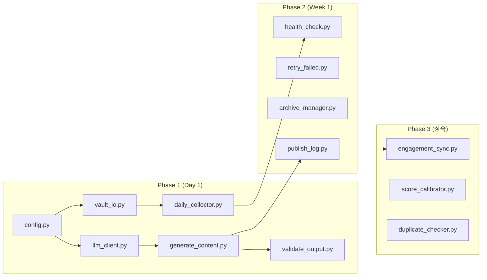

# 콘텐츠 생성 파이프라인 스크립트 구현 계획

Picko 프로젝트의 콘텐츠 수집 → 생성 → 발행 파이프라인을 자동화하는 스크립트 시스템 설계 문서입니다.

---

## 프로젝트 구조

```
Picko/
├── scripts/                    # 실행 스크립트
│   ├── daily_collector.py      # A) Daily Collector
│   ├── generate_content.py     # B) Approve → Generate
│   ├── explore_topic.py        # C) 주제 탐색 및 확장
│   ├── style_extractor.py      # D) 레퍼런스 스타일 추출
│   ├── health_check.py         # 파이프라인 상태 점검
│   ├── validate_output.py      # 생성물 검증
│   ├── archive_manager.py      # 라이프사이클 관리
│   └── publish_log.py          # 발행 로그 생성
│
├── picko/                      # 공통 모듈 패키지
│   ├── __init__.py
│   ├── config.py               # 설정 로더
│   ├── vault_io.py             # Obsidian Vault 읽기/쓰기
│   ├── account_context.py      # 계정 페르소나/슬롯 로더
│   ├── prompt_loader.py        # 외부 프롬프트 템플릿 로더
│   ├── prompt_composer.py      # 멀티 레이어 프롬프트 합성기
│   ├── llm_client.py           # LLM API 클라이언트
│   ├── embedding.py            # 임베딩 생성/관리
│   ├── scoring.py              # 페르소나 기반 점수 계산
│   └── templates.py            # 템플릿 렌더링
│
├── config/
│   ├── config.yml              # 메인 설정
│   ├── sources.yml             # RSS 소스
│   ├── prompts/                # 외부 프롬프트 (Jinja2)
│   ├── reference_styles/       # 추출된 부가 스타일
│   └── accounts/               # 계정 프로필 및 정체성
│
├── logs/                       # 실행 로그
│   └── YYYY-MM-DD/
│       ├── daily_collector.log
│       └── generate_content.log
│
└── cache/                      # 임베딩/API 캐시
    ├── embeddings/
    └── responses/

```

---

## Phase 1: 필수 (Day 1)

### A) Daily Collector

#### [NEW] [config.py](file:///H:/내 드라이브/obsidian_GGD/side-projects/Files/Side_projects/Picko/picko/config.py)
- `config/config.yml` 로드 및 파싱
- 환경변수 오버라이드 지원 (API 키 등)
- 계정 프로필 로드 (`config/accounts/*.yml`)

#### [NEW] [vault_io.py](file:///H:/내 드라이브/obsidian_GGD/side-projects/Files/Side_projects/Picko/picko/vault_io.py)
- Obsidian 노트 CRUD 함수
- YAML frontmatter 파싱/생성
- 내부 링크 (`[[...]]`) 처리

#### [NEW] [daily_collector.py](file:///H:/내 드라이브/obsidian_GGD/side-projects/Files/Side_projects/Picko/scripts/daily_collector.py)

```python
# 실행: python -m scripts.daily_collector --date 2026-02-09

def main(date: str, dry_run: bool = False):
    # 1. ingest: RSS/크롤링에서 URL 수집
    # 2. dedupe: URL 정규화 + 해시 기반 중복 제거
    # 3. fetch: 본문/제목/발행일 추출
    # 4. nlp: LLM으로 요약/핵심/태깅
    # 5. embed: 임베딩 생성
    # 6. score: novelty/relevance/quality/total 계산
    # 7. export: Inbox/Inputs/{input_id}.md 생성
    # 8. digest: Inbox/Inputs/_digests/YYYY-MM-DD.md 생성
```

| CLI 옵션 | 설명 |
|---------|------|
| `--date` | 대상 날짜 (기본: 오늘) |
| `--dry-run` | 저장 없이 시뮬레이션 |
| `--sources` | 특정 소스만 처리 |
| `--account` | 특정 계정 프로필만 적용 |

---

### B) Approve → Generate

#### [NEW] [llm_client.py](file:///H:/내 드라이브/obsidian_GGD/side-projects/Files/Side_projects/Picko/picko/llm_client.py)
- OpenAI/Claude API 추상화
- 재시도 로직 (exponential backoff)
- 응답 캐싱 (동일 프롬프트 재사용)

#### [NEW] [templates.py](file:///H:/내 드라이브/obsidian_GGD/side-projects/Files/Side_projects/Picko/picko/templates.py)
- Jinja2 기반 템플릿 렌더링
- 채널별 패키징 템플릿 로드

#### [NEW] [generate_content.py](file:///H:/내 드라이브/obsidian_GGD/side-projects/Files/Side_projects/Picko/scripts/generate_content.py)

```python
# 실행: python -m scripts.generate_content --date 2026-02-09

def main(date: str):
    # 1. Digest 파싱: [x] 체크된 항목에서 (account_id, input_id) 추출
    # 2. 각 승인 항목에 대해:
    #    a) longform 생성 → Content/Longform/{id}.md
    #    b) packs 생성 → Content/Packs/{channel}/{id}.md
    #    c) image_prompts 생성 → Assets/Images/_prompts/{id}.md
    # 3. Digest 항목에 status: generated, generated_at 업데이트
```

| CLI 옵션 | 설명 |
|---------|------|
| `--date` | Digest 날짜 (기본: 오늘) |
| `--type` | 생성 유형 (longform/packs/images/all) |
| `--force` | 이미 생성된 항목도 재생성 |

---

### C) 생성물 검증

#### [NEW] [validate_output.py](file:///H:/내 드라이브/obsidian_GGD/side-projects/Files/Side_projects/Picko/scripts/validate_output.py)

```python
# 실행: python -m scripts.validate_output --path Content/Longform/

def validate(path: str):
    # 1. YAML frontmatter 필수 필드 검증
    # 2. 템플릿 필수 섹션 존재 여부
    # 3. 내부 링크 유효성 검사
    # 4. 결과 리포트 출력
```

---

## Phase 2: 권장 (Week 1)

### 파이프라인 상태 점검

#### [NEW] [health_check.py](file:///H:/내 드라이브/obsidian_GGD/side-projects/Files/Side_projects/Picko/scripts/health_check.py)

```python
# 실행: python -m scripts.health_check

def check_all():
    checks = [
        check_sources(),      # RSS 피드 접근성
        check_api_keys(),     # LLM API 키 유효성
        check_vault_access(), # Vault 읽기/쓰기 권한
        check_disk_space(),   # 저장 공간
    ]
    print_report(checks)
```

---

### 실패 재시도

#### [NEW] [retry_failed.py](file:///H:/내 드라이브/obsidian_GGD/side-projects/Files/Side_projects/Picko/scripts/retry_failed.py)

```python
# 실행: python -m scripts.retry_failed --date 2026-02-09

def retry(date: str, stage: str = None):
    # logs/{date}/에서 실패 항목 파싱
    # 해당 stage만 재실행
```

---

### Inbox 아카이브

#### [NEW] [archive_manager.py](file:///H:/내 드라이브/obsidian_GGD/side-projects/Files/Side_projects/Picko/scripts/archive_manager.py)

```python
# 실행: python -m scripts.archive_manager --days 30

def archive_old_inputs(days: int):
    # N일 지난 미승인 Input → Archive/ 이동
    # 관련 임베딩 캐시 정리
```

---

### 발행 로그 생성

#### [NEW] [publish_log.py](file:///H:/내 드라이브/obsidian_GGD/side-projects/Files/Side_projects/Picko/scripts/publish_log.py)

```python
# 실행: python -m scripts.publish_log --content Content/Longform/xxx.md

def create_log(content_path: str):
    # 발행 로그 템플릿 기반으로 초안 생성
    # Logs/Publish/{id}.md 저장
```

---

## Phase 3: 콘텐츠 고도화 (v0.3.0 ~ v0.4.0)

### 주제 탐색 및 스타일 추출

#### [NEW] [explore_topic.py](scripts/explore_topic.py)
- 롱폼 작성 전 LLM과 대화하며 주제 확장
- `Inbox/Explorations/`에 생각의 흔적 저장

#### [NEW] [style_extractor.py](scripts/style_extractor.py)
- 레퍼런스 URL 분석하여 작성 스타일(특징, 말투, 구조) 추출
- `config/reference_styles/`에 프로필 저장

### 계정 컨텍스트 및 프롬프트 합성

#### [NEW] [account_context.py](picko/account_context.py)
- `AccountIdentity`: 계정의 목표, 타깃, 말투 정의
- `WeeklySlot`: 주간 콘텐츠 배분 및 KPI 관리

#### [NEW] [prompt_composer.py](picko/prompt_composer.py)
- **Layered Prompting**: Base + Style + Identity + Context 결합
- 상황에 맞는 최적의 프롬프트 자동 생성

### 성과 메트릭 동기화

#### [NEW] [engagement_sync.py](scripts/engagement_sync.py)
- 플랫폼 API에서 조회수/좋아요 수집
- Publish Log 자동 업데이트

### 점수 보정

#### [NEW] [score_calibrator.py](scripts/score_calibrator.py)
- 실제 성과 ↔ 예측 점수 비교 분석
- 가중치 조정 제안

### 중복 검사

#### [NEW] [duplicate_checker.py](scripts/duplicate_checker.py)
- 임베딩 기반 유사도 검사
- 기존 발행물과 중복 경고

---

## 로깅 표준

모든 스크립트는 통일된 로깅 형식을 사용합니다:

```
logs/
└── 2026-02-09/
    ├── daily_collector.log
    ├── generate_content.log
    └── errors.log          # 모든 에러 통합
```

```python
# picko/logger.py
import loguru

def get_logger(script_name: str):
    return loguru.logger.bind(script=script_name)
```

---

## 검증 계획

### 자동화 테스트

| 테스트 | 명령어 | 검증 내용 |
|--------|--------|----------|
| Unit Tests | `pytest tests/unit/` | 개별 함수 로직 |
| Integration | `pytest tests/integration/` | 모듈 간 연동 |
| Dry Run | `python -m scripts.daily_collector --dry-run` | 실제 저장 없이 플로우 확인 |

### 수동 검증

1. **Daily Collector 테스트**
   - 테스트 RSS 피드 (2-3개 항목) 설정
   - `--dry-run`으로 실행
   - 출력된 Input 노트 구조 확인

2. **Generate Content 테스트**
   - 테스트 Digest 파일 생성 (2개 항목 체크)
   - 스크립트 실행
   - 생성된 Longform/Packs/ImagePrompts 확인

3. **Validate Output 테스트**
   - 의도적으로 잘못된 노트 생성
   - 검증 스크립트가 오류 탐지하는지 확인

---

## 구현 우선순위 요약



---

## 다음 단계

1. 사용자 승인 후 Phase 1 구현 시작
2. `picko/config.py` → `picko/vault_io.py` 순서로 공통 모듈 먼저 구현
3. 각 스크립트 구현 후 `--dry-run` 테스트
