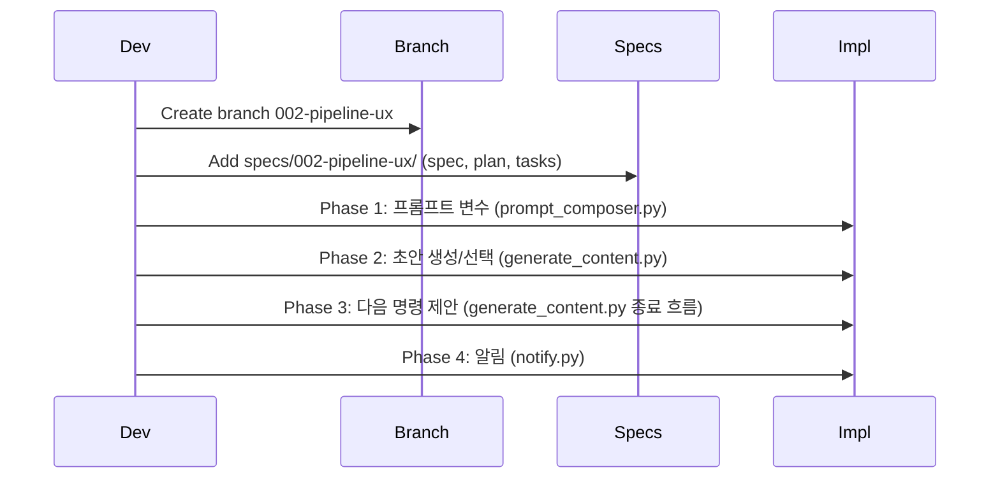

# 브랜치 및 스펙 문서 전략

## 1. 브랜치

- **브랜치 이름**: `002-pipeline-ux` 또는 `feature/pipeline-ux`  
  - 기존 [specs/001-openrouter-provider/spec.md](specs/001-openrouter-provider/spec.md)에서 Feature Branch가 `001-openrouter-provider`, plan.md에서는 `feature/openrouter-provider`를 쓰고 있으므로, 팀 규칙에 맞춰 둘 중 하나로 통일하면 됨.
- **작업 범위**: 다음 네 가지를 이 브랜치에서 진행.
  - 프롬프트 개선 (롱폼, 팩, 이미지)
  - 2~3개 초안 생성 후 사람이 선택
  - 알림(텔레그램 등) 발송 + "응답 완료" 신호
  - 승인 후 다음 명령 제안 / 필요 시 자동 진행

### 1.1 단일 브랜치 유지 근거

> ⚠️ **리뷰 반영**: 4개 영역을 단일 브랜치에서 진행하는 것에 대한 우려가 있음. 그러나 다음 이유로 유지:

| 우려 사항 | 대응 |
|-----------|------|
| generate_content.py 충돌 리스크 | **Phase별 순차 구현**으로 충돌 최소화. 각 Phase 완료 후 commit. |
| 영역 3(알림)은 외부 의존성 도입 | 텔레그램 등은 **선택적 의존성**으로 처리 (`extras_require`). |
| 병렬 구현 시 merge conflict | 병렬이 아닌 **순차 구현** 권장. |

**대안 기각**: 3개 PR로 분리 시 관리 오버헤드 증가, 영역 간 의존성(프롬프트 → 초안 생성) 고려 시 단일 브랜치가 자연스러움.

---

## 2. 스펙 문서를 별도로 만드는 것이 좋은지

**권장: 별도 스펙 문서를 만드는 것을 추천합니다.**

이유:

- **추적성**: 001과 동일하게 "무엇을 왜 만들었는지"가 `specs/`에 남아서, 나중에 회귀 테스트·리뷰·온보딩에 유리합니다.
- **승인 기준 정리**: 각 작업(프롬프트, 초안 선택, 알림, 다음 명령)별로 "어떤 조건이면 완료인지"를 스펙에 적어 두면 구현·QA가 수월합니다.
- **기존 패턴과 일관성**: [specs/001-openrouter-provider/](specs/001-openrouter-provider)에 `spec.md`, `plan.md`, `tasks.md`, `checklists/requirements.md` 구조가 있으므로, 002도 같은 구조를 쓰면 프로젝트 규칙과 맞습니다.
- **범위가 넓음**: 네 가지 주제를 한 브랜치에서 다루므로, 스펙 한 곳에 모두 정리해 두는 편이 "이 브랜치가 무엇을 바꾸는지"를 한 번에 보기 좋습니다.

따라서 **스펙 문서는 별도 폴더로 두고, 이 브랜치의 범위를 그 스펙으로 정의하는 방식**을 추천합니다.

---

## 3. 스펙 문서 구조 제안

기존 001 패턴을 따르면:

```
specs/002-pipeline-ux/
├── spec.md              # 기능 명세 (User Stories, Acceptance)
├── plan.md              # 기술 배경, 수정 대상 파일, 의존성
├── tasks.md             # Phase별 태스크 (T001, T002, ...)
└── checklists/
    └── requirements.md  # 품질/체크리스트
```

**spec.md에 넣을 내용 (4개 영역)**:


| 영역             | 스펙에 쓸 내용                                                                                |
| -------------- | --------------------------------------------------------------------------------------- |
| **프롬프트 개선**    | 롱폼/팩/이미지 프롬프트 개선 목표, 계정·채널 변수 반영, 독자·톤·형식 지시 (User Story + Acceptance 시나리오)             |
| **2~3개 초안 선택** | 롱폼(또는 팩) 초안 N개 생성, 저장 형식, "선택된 초안" 표시 방식 및 다운스트림 동작 (Given/When/Then)                   |
| **알림 + 응답 완료** | 알림 발송 시점(일 수집 직후, 생성 전/후 등), 발송 수단(텔레그램 등), "응답 완료" 신호(파일/스크립트/봇) 정의                    |
| **다음 명령 제안**   | daily_collector/generate_content 종료 시 출력할 다음 명령 문구, "추가 개입 불필요 시 완료만 표시", 자동 진행 조건(있다면) |


**plan.md**: 수정할 파일(`config/prompts/`, `scripts/daily_collector.py`, `scripts/generate_content.py`, 알림 모듈 등), 새 의존성(텔레그램 봇 시), 테스트 전략 요약.

**tasks.md**: Phase 구분 예시 — Phase 1 프롬프트, Phase 2 초안 생성/선택, Phase 3 다음 명령 제안, Phase 4 알림(선택). 각 Phase 내에 [P?] [Story] 형식 태스크 나열.

---

## 4. 핵심 설계 결정 (Design Decisions)

> ⚠️ **리뷰 반영**: plan은 "왜, 어떤 설계 결정"에 집중해야 함. 구현 전 반드시 확정할 사항:

### D1. 초안 저장 형식 (Draft Storage Format)

**결정**: N개 초안 = N개 별도 파일 (N-파일 방식)

```
Content/Longform/2026-02-17/
├── article-001.md              # 선택된 초안 (N=1일 때와 동일한 이름)
└── .drafts/
    └── article-001/
        ├── draft-1.md          # 초안 1
        ├── draft-2.md          # 초안 2
        └── draft-3.md          # 초안 3
```

**이유**:
- Vault에서 각 초안을 독립적으로 조회/비교 가능
- 파일 삭제로 미선택 초안 정리 용이
- 이미지/발행 스크립트는 `.drafts/` 폴더를 무시하면 됨

**대안 기각**: 1파일 N블록 방식은 YAML frontmatter에 배열 저장 필요, vault 검색/비교 어려움.

### D2. 선택된 초안 표시 (Selected Draft Expression)

**결정**: 최종 파일명 규칙 유지 + `draft_selected` 프론트매터 필드

```yaml
# 선택된 초안 파일 (기존과 동일한 위치/이름)
---
title: "Article Title"
draft_selected: true
draft_id: "draft-2"
draft_selected_at: "2026-02-17T15:00:00"
---
```

**이유**: 기존 downstream 스크립트가 파일 경로를 변경할 필요 없음.

**대안 기각**: `*_selected.md` 파일명 접미사는 모든 downstream 스크립트의 파일 탐지 로직 변경 필요.

### D3. config.yml 스키마 (Configuration Schema)

**확정 구조**:

```yaml
interaction:
  draft:
    max_count: 5                    # 최대 초안 수 (1-5)
    deadline_hours: 24              # 마감까지 시간
    deadline_time: "12:00"          # 구체적 마감 시각
    reminder_interval_hours: 2      # 리마인더 간격
    auto_select_on_deadline: true   # 마감 시 자동 선택
  
  notification:
    primary: "console"              # console | telegram | both
    fallback: "log"                 # log | file
    telegram_token: null            # 환경 변수로 관리 권장
    include_details: true
    retry_count: 3
    retry_delay_seconds: 5
  
  suggestion:
    enabled: true
    primary: "terminal"
    fallback_file: "logs/suggestions.txt"
    context_aware: true
```

**위치**: `config/config.yml` 최상위 레벨에 `interaction:` 섹션 추가

### D4. 하위 호환성 (Backward Compatibility)

| 항목 | N=1 (기본) | N>1 |
|------|------------|-----|
| 출력 파일명 | `article-001.md` | `article-001.md` (선택된 것만) |
| `.drafts/` 폴더 | 생성 안 함 | 생성 (미선택 초안 보관) |
| 프론트매터 | 기존과 동일 | `draft_*` 필드 추가 |
| downstream 영향 | 없음 | `.drafts/` 무시 필요 |

**validate_output.py 수정 필요**: `.drafts/` 폴더 내 파일은 검증에서 제외.

### D5. 알림 모듈 의존성

**결정**: `python-telegram-bot` (선택적 의존성)

```python
# requirements.txt
python-telegram-bot>=20.0  # optional

# pyproject.toml
[project.optional-dependencies]
telegram = ["python-telegram-bot>=20.0"]
```

**설치**: `pip install picko-scripts[telegram]` 또는 기본 설치 시 console/log만 사용.

**근거**:
- `python-telegram-bot`은 에러 처리, 재시도, 타입 안전성 면에서 `requests` 직접 사용보다 우수
- sendMessage만 필요해도 SDK의 장점(자동 재시도, 예외 클래스, 응답 파싱)이 큼
- 20+ 의존성은 `extras_require`로 선택적 설치 가능

**기각 대안**: `requests` 직접 호출 — 유지보수 부담 증가, 에러 처리 직접 구현 필요.

### D6. --auto-proceed 자동 진행

**결정**: **Out of Scope (이번 feature에서 제외)**

**이유**:
- `--auto-all`, `--force`와 조합 시 LLM 비용 폭주 및 vault 대량 덮어쓰기 위험
- 안전장치 설계(최대 실행 횟수, dry-run 기본값, 이중 확인)가 복잡
- 향후 별도 feature에서 `--auto-proceed --dry-run` 기본 + `--confirm` 이중 확인 패턴으로 구현 권장

---

## 5. 엣지 케이스 (Edge Cases)

> ⚠️ **리뷰 반영**: 누락된 엣지 케이스 명시적 정의.

### E1. N개 초안 생성 중 k번째에서 실패 (1 < k ≤ N)

**시나리오**: LLM 호출 k번째에서 실패 시 부분 생성된 초안 처리

**처리 정책**:
- 생성된 초안(k-1개)만 저장
- 프론트매터에 `draft_count_actual: k-1` 기록
- 로그에 실패 원인 기록
- 사용자에게 부분 완료 알림

### E2. 재실행(--force) 시 기존 초안과의 관계

**시나리오**: 동일 입력에 대해 재실행 시 기존 N개 초안 처리

**처리 정책**:
- 기존 `.drafts/{input_id}/` 폴더 전체 삭제 후 재생성
- 또는 `_v{timestamp}_draft{n}.md` 버전 증가 (config로 선택 가능)
- 기본값: **덮어쓰기** (기존 폴더 삭제)

### E3. 다중 선택 또는 0개 선택

**시나리오**: 운영자가 0개 또는 2개 이상 초안에 `selected: true` 표시

**처리 정책**:
- **0개 선택**: 아무 작업 안 함 (pending 상태 유지), 리마인더 계속 발송
- **2개 이상 선택**: 첫 번째만 유효로 간주, 나머지는 `selected: false`로 자동 수정 + 경고 로그

### E4. 팩 채널별 초안 생성

**시나리오**: twitter/linkedin/newsletter 각각에 대해 N개 초안 생성 시 N×3 파일

**처리 정책**:
- **채널당 독립 N개** 생성 (N×3 파일)
- 선택도 채널당 각각 수행
- 프론트매터에 `channel: twitter` 명시

### E5. 알림 전송 중 네트워크 타임아웃

**시나리오**: 알림 전송 실패 시 재시도

**처리 정책**:
- 최대 3회 재시도
- 지수 백오프: 1s → 2s → 4s
- 모든 재시도 실패 시 fallback file에 기록

### E6. draft_count 값 검증

**시나리오**: draft_count 값이 0, 음수, 또는 문자열

**처리 정책**:
- config 로드 시 검증: `1 ≤ draft_count ≤ 5`
- 범위 외 값은 기본값(1)으로 fallback
- 경고 로그 기록

### E7. 완료 신호 파일 쓰기 권한 없음

**시나리오**: 완료 신호 파일 경로에 쓰기 권한 없음

**처리 정책**:
- stderr 경고 출력
- 파이프라인은 성공으로 처리 (알림 실패가 본질적 기능 실패가 아님)
- 로그에 권한 오류 기록

### E8. 이미 선택된 초안이 있는 상태에서 새 초안 생성

**시나리오**: 기존 `draft_selected: true`인 초안 존재 시 재생성

**처리 정책**:
- 기존 선택 상태 초기화 (`.drafts/` 폴더 삭제로 해결)
- 새 초안 생성 후 다시 선택 필요
- 경고 메시지: "기존 선택이 초기화됩니다"

---

## 6. 사전 필수 작업 (Pre-Implementation Requirements)

### 6.1 Audit 태스크: 영역 1 착수 전 필수 조사

> ⚠️ **리뷰 반영**: 영역 1 (프롬프트 변수 주입) 구현 전, 실제 누락 변수 목록 조사 필요.

**Audit 체크리스트**:
- [ ] `PromptComposer.apply_identity()`에서 설정하는 변수 목록 확인
- [ ] `PromptComposer.apply_style()`에서 style characteristics를 변수로 노출하는지 확인
- [ ] `PromptComposer.apply_context()`에서 pillar_distribution 변수화 여부 확인
- [ ] `PromptLoader.get_pack_prompt()`에 전달되는 변수 목록 확인
- [ ] 기존 프롬프트 템플릿(`config/prompts/*.md`)에서 사용하는 변수 목록 수집
- [ ] 새 변수 명명 규칙(`account.*`, `style.*`, `channel.*`, `weekly.*`)과 기존 변수 충돌 여부 확인

### 6.2 테스트 픽스처 설계

초안 선택 플로우 테스트를 위한 픽스처:

```python
# tests/conftest.py

@pytest.fixture
def pending_draft_selection(tmp_path):
    """대기 중인 초안 선택 상태 시뮬레이션."""
    draft_dir = tmp_path / "Content" / "Longform" / ".drafts" / "article-001"
    draft_dir.mkdir(parents=True)
    
    for i in range(1, 4):
        draft_file = draft_dir / f"draft-{i}.md"
        draft_file.write_text(f"---\ntitle: Draft {i}\nscore: {0.9 - i*0.05}\n---\nContent {i}")
    
    return draft_dir

@pytest.fixture
def selected_draft(tmp_path):
    """선택 완료된 초안 상태 시뮬레이션."""
    output_file = tmp_path / "Content" / "Longform" / "article-001.md"
    output_file.parent.mkdir(parents=True)
    output_file.write_text("""---
title: Selected Article
draft_selected: true
draft_id: draft-2
---
Selected content...
""")
    return output_file
```

---

## 7. Phase 의존성 및 실행 순서 (Dependencies & Execution Order)

> ⚠️ **리뷰 반영**: Phase 간 논리적 의존성과 충돌 방지를 위한 순차 실행 명시.

### 의존성 매트릭스

| Phase | 내용 | 논리적 선행 | 파일 충돌 위험 | 권장 순서 |
|-------|------|-------------|----------------|-----------|
| Phase 1 | 프롬프트 변수 주입 | 없음 | `prompt_composer.py`, `prompt_loader.py` | 1순위 |
| Phase 2 | 초안 생성/선택 | 없음 (Phase 1과 독립) | `generate_content.py` (대폭 수정) | 2순위 |
| Phase 3 | 다음 명령 제안 | Phase 2 완료 후 | `generate_content.py` (종료 흐름) | 3순위 |
| Phase 4 | 알림 | Phase 2·3 완료 후 | 새 모듈 (`notify.py`) | 4순위 |

### 상세 설명

1. **Phase 1 (프롬프트)**: 선행 없음. `generate_content.py` 수정 범위가 작으므로 먼저 완료.
2. **Phase 2 (초안 선택)**: Phase 1과 논리적 의존 없으나, `generate_content.py` 충돌 방지를 위해 Phase 1 완료 후 착수 권장.
3. **Phase 3 (다음 명령)**: **Phase 2 완료 후**. `generate_content.py` 종료 흐름이 Phase 2에서 변경되므로, 그 위에 다음 명령 로직을 얹음.
4. **Phase 4 (알림)**: **Phase 2·3 완료 후**. 알림 메시지에 초안 구조·다음 명령 정보가 포함될 수 있음.

**병렬 실행**: 권장하지 않음. `generate_content.py`가 Phase 1·2·3 모두에서 수정되므로 merge conflict 불가피.

---

## 8. 리스크 & 완화 전략 (Risks & Mitigations)

> ⚠️ **리뷰 반영**: 상세 리스크 테이블로 확장.

| ID | Risk | Impact | Likelihood | Mitigation | Owner |
|----|------|--------|------------|------------|-------|
| R1 | **LLM 비용 N배 증가** | 높음 | 확실 | draft_count 기본값 1, config에 비용 경고 주석, 운영자 가이드 문서화 | 구현 |
| R2 | **--auto-proceed로 의도치 않은 대량 생성** | 높음 | 중간 | **Out of scope**로 제외. 향후 구현 시 `--dry-run` 기본 + `--confirm` 이중 확인 | 설계 |
| R3 | **텔레그램 봇 토큰 유출** | 높음 | 중간 | 토큰은 환경변수(`TELEGRAM_BOT_TOKEN`)만 사용. config.yml 직접 기재 금지. `.gitignore` 확인. **로그에 토큰 마스킹 필터 추가**. | 구현 |
| R4 | **잘못된 chat_id로 알림 발송** | 중간 | 낮음 | 최초 설정 시 테스트 메시지 발송 + 확인 단계. `health_check.py`에 알림 채널 검증 추가. | 구현 |
| R5 | **초안 선택 없이 장기 방치** | 중간 | 높음 | `auto_select_on_deadline` 설정으로 마감 시 자동 선택. `archive_manager.py`와 연계하여 장기 미선택 항목 정리. | 설계 |
| R6 | **generate_content.py 4개 Phase 수정 충돌** | 중간 | 확실 | **Phase 순차 실행**으로 완화. 각 Phase 완료 후 commit. | 프로세스 |
| R7 | **완료 신호 파일 이전 실행과 구분 불가** | 낮음 | 중간 | 파일명에 타임스탬프 포함 또는 파일 내용에 실행 ID 기록. | 구현 |
| R8 | **N개 초안 생성 중 부분 실패** | 중간 | 중간 | E1 정책 참조: 완료된 초안만 저장, `draft_count_actual` 기록, 로그에 실패 원인 기록. | 구현 |

### 로그 토큰 마스킹 (R3 상세)

```python
# picko/logger.py에 추가
import re

class TokenMaskingFilter:
    """환경변수 값을 로그에서 자동 마스킹."""
    
    SENSITIVE_PATTERNS = [
        r'\d{10,}:[A-Za-z0-9_-]{30,}',  # Telegram bot token pattern
    ]
    
    def __call__(self, record):
        for pattern in self.SENSITIVE_PATTERNS:
            record["message"] = re.sub(pattern, '***TOKEN***', record["message"])
        return True

# loguru 설정에 필터 추가
logger.add(..., filter=TokenMaskingFilter())
```

---

## 9. 비용 영향 (Cost Impact)

> ⚠️ **리뷰 반영**: 운영자가 인지해야 할 비용 증가.

| 초안 수 | API 호출 | 예상 비용 (GPT-4o-mini 기준) |
|---------|----------|------------------------------|
| 1 (기본) | 1× | 기존과 동일 |
| 2 | 2× | 약 2배 |
| 3 | 3× | 약 3배 |
| 5 (최대) | 5× | 약 5배 |

**운영자 가이드**:
- 중요 콘텐츠에만 N>1 사용 권장
- 일반 콘텐츠는 N=1 (기본값) 유지
- CI/CD 환경에서는 `--drafts 1` 명시 권장

---

## 10. 진행 순서 제안



### 실행 순서 (순차 권장)

1. **브랜치 생성**: `002-pipeline-ux`(또는 `feature/pipeline-ux`) 생성 후 해당 브랜치에서만 작업.
2. **스펙 작성**: `specs/002-pipeline-ux/spec.md`를 먼저 작성해 네 가지 영역의 User Story·Acceptance를 고정. 이어서 `plan.md`, `tasks.md`, `checklists/requirements.md`를 채움.
3. **Phase 1 구현**: 프롬프트 변수 주입 → commit
4. **Phase 2 구현**: 초안 생성/선택 → commit (generate_content.py 충돌 방지)
5. **Phase 3 구현**: 다음 명령 제안 → commit
6. **Phase 4 구현**: 알림 모듈 → commit

**주의**: 각 Phase 완료 후 반드시 commit하여 충돌 최소화.

---

## 11. 요약

- **브랜치**: 하나의 새 브랜치(`002-pipeline-ux` 또는 `feature/pipeline-ux`)에서 네 가지 작업 전부 진행.
- **스펙**: 별도 스펙 문서를 두는 것을 권장. `specs/002-pipeline-ux/`에 001과 동일한 구조로 `spec.md`, `plan.md`, `tasks.md`, `checklists/requirements.md`를 두고, 스펙에 "프롬프트 / 초안 선택 / 알림·응답완료 / 다음 명령 제안"을 모두 정의.
- **설계 결정**: D1~D6까지 구현 전 확정 필요. D6(--auto-proceed)는 **Out of Scope**.
- **엣지 케이스**: E1~E8까지 명시적 처리 정책 정의.
- **Phase 의존성**: 순차 실행 권장 (Phase 1 → 2 → 3 → 4). 병렬 실행 시 충돌 위험.
- **리스크 관리**: R1~R8까지 식별 및 완화 전략 수립. 특히 토큰 마스킹 필수.
- **사전 작업**: Audit 태스크로 누락 변수 조사 선행.
